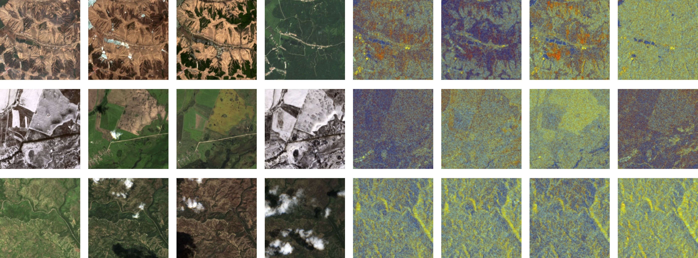
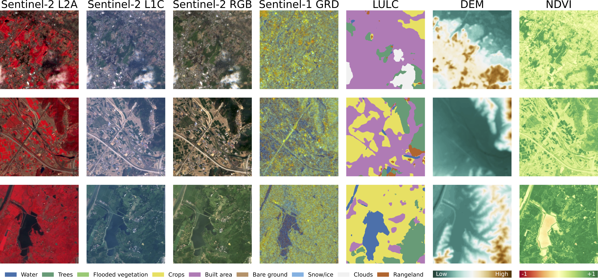

[](https://arxiv.org/abs/2503.00168)
[](https://huggingface.co/datasets/embed2scale/SSL4EO-S12-v1.1)

# SSL4EO-S12 v1.1

SSL4EO-S12 v1.1 is an updated multimodal version of the popular EO pre-training dataset [SSL4EO-S12](https://github.com/zhu-xlab/SSL4EO-S12).
Read more about the reasons behind our update and further improvements in our technical report on [arXiv](https://arxiv.org/abs/2503.00168).  

## NEWS

- Feb 19, 2026: We fixed a temporal alignment issue in the Sentinel-1 GRD data which was not sorted by date (see [issue](https://github.com/DLR-MF-DAS/SSL4EO-S12-v1.1/issues/4)). Thank you, [Thomas](https://github.com/thomas-gorman-ai), for reporting the issue!
- Feb 17, 2026: SSL4EO-S12 v1.1 is now available as a webdataset version for better usability at [HuggingFace](https://huggingface.co/datasets/embed2scale/SSL4EO-S12-v1.1).
- Mar 11, 2025: SSL4EO-S12 v1.1 available as a Zarr chunk file version on [HuggingFace](https://huggingface.co/datasets/embed2scale/SSL4EO-S12-v1.1-Zarr).
- Mar 10, 2025: SSL4EO-S12 v1.1 utilized as pre-training dataset for [2025 CVPR EARTHVISION data challenge](https://www.grss-ieee.org/events/earthvision-2025/?tab=challenge):
    * details: [https://github.com/DLR-MF-DAS/embed2scale-challenge-supplement](https://github.com/DLR-MF-DAS/embed2scale-challenge-supplement)
    * tech support: [https://github.com/DLR-MF-DAS/embed2scale-challenge-supplement/issues](https://github.com/DLR-MF-DAS/embed2scale-challenge-supplement/issues)


## Data

The dataset includes 246,144 locations with four timestamps each from the modalities S2L1C, S2L2A, S1GRD, S2RGB, NDVI, LULC, and a single timestamp DEM.
We refer to our [technical report](https://arxiv.org/abs/2503.00168) for details.

Sentinel-2 and Sentinel-1 time series examples with four seasonal images:



Modality examples in SSL4EO-S12 v1.1:



## Download

You can download the dataset via the Hugging Face CLI (`pip install huggingface_hub`). Please note that the full dataset requires 2.3TB of storage.

```shell
hf download embed2scale/SSL4EO-S12-v1.1 --repo-type dataset --local-dir data/SSL4EOS12
```

If you like to download only a subset of the data, you can specify it with `--include`.
```shell
# Only download val data
hf download embed2scale/SSL4EO-S12-v1.1 --repo-type dataset --include "val/*" --local-dir data/SSL4EOS12

# Only download a single modality (e.g., S2L2A)
hf download embed2scale/SSL4EO-S12-v1.1 --repo-type dataset --include "*/S2L2A/*" --local-dir data/SSL4EOS12
```

For development, `webdataset` supports data streaming and does not need any local data.

## Usage

Set up your env with 
```shell
pip install -r requirements.txt

# or install the packages manually via
pip install huggingface_hub webdataset zarr==2.18.0 numcodecs==0.15.1 torch numpy albumentations fsspec braceexpand 
```

We provide code for a PyTorch dataloader in [ssl4eos12_dataset.py](ssl4eos12_dataset.py) which you can download with
```shell
wget https://raw.githubusercontent.com/DLR-MF-DAS/SSL4EO-S12-v1.1/refs/heads/main/ssl4eos12_dataset.py
```

You can use the `build_ssl4eos12_dataset` function to initialize a dataset, which uses the WebDataset package to load samples from the shard files. You can stream the data from Hugging Face using the urls or download the full dataset and pass a local path (e.g, `data/SSL4EOS12/`).
```python
from ssl4eos12_dataset import build_ssl4eos12_dataset
from torch.utils.data import DataLoader

# If you only pass one modality, the modality is loaded with the "image" key
dataset = build_ssl4eos12_dataset(
    path="https://huggingface.co/datasets/embed2scale/SSL4EO-S12-v1.1/resolve/main/",  # Streaming or local path
    modalities=["S2L2A"], 
    split="val",
    batch_size=8
)
# Batch keys: ["__key__", "__url__", "image"]

# If you pass multiple modalities, the modalities are returned using the modality names as keys
dataset = build_ssl4eos12_dataset(
    path="https://huggingface.co/datasets/embed2scale/SSL4EO-S12-v1.1/resolve/main/",  # Streaming or local path
    modalities=["S2L2A", "S2L1C", "S2RGB", "S1GRD", "DEM", "NDVI", "LULC"], 
    split="val",
    batch_size=8,    
)

# Set batch size to None because batching is handled by WebDataset.
dataloader = DataLoader(dataset, batch_size=None, num_workers=4, persistent_workers=True, prefetch_factor=1)

# Iterate over the dataloader
for batch in dataloader:
    print("Batch keys:", list(batch.keys()))
    # Batch keys: ["__key__", "__url__", "S2L2A", "S2L1C", "S2RGB", "S1GRD", "DEM", "NDVI", "LULC"]

    print("Data shape:", batch["S2L2A"].shape)
    # Data shape: torch.Size([8, 4, 12, 264, 264]
    # Dimensions [batch, time, channel, h, w]
    break
```

The data in SSL4EO-S12 v1.1 is sorted by date, meaning that each timestep can be from any season. 
If you like to load the data with fixed seasons, pass `reindex_seasonal=True` to `build_ssl4eos12_dataset()` and the loaded data is sorted by season while ignoring the year. 
I.e., the first timestamp is from the first yearly quartal, followed by the second and so on.  

### Data transform

We provide some additional code for wrapping `albumentations` transform functions.
We recommend albumentations because parameters are shared between all image modalities (e.g., same random crop). 
However, it requires some code wrapping to bring the data into the expected shape.  

```python
import albumentations as A
from albumentations.pytorch import ToTensorV2
from ssl4eos12_dataset import (build_ssl4eos12_dataset, Transpose, MultimodalTransforms, MultimodalNormalize, 
                               FlattenTemporalIntoChannels, UnflattenTemporalFromChannels, statistics)

# Define all image modalities
modalities = ["S2L2A", "S2L1C", "S2RGB", "S1GRD", "DEM", "NDVI", "LULC"]

# Define multimodal transform function that converts the data into the expected shape from albumentations
val_transform = MultimodalTransforms(
    transforms=A.Compose([  # We use albumentations because of the shared transform between image modalities
        Transpose([0, 2, 3, 1]),  # Convert data to channel last (expected shape from albumentations)
        MultimodalNormalize(mean=statistics["mean"], std=statistics["std"]),
        # CenterCrop other transformations cannot handle temporal data. Needs to be applied after MultimodalNormalize
        FlattenTemporalIntoChannels(),
        A.CenterCrop(224, 224),  # Use center crop in val split
        # A.RandomCrop(224, 224),  # Use random crop in train split
        # A.D4(),  # Optionally, use random flipping and rotation for the train split
        ToTensorV2(),  # Convert to tensor and back to channel first
        UnflattenTemporalFromChannels(n_timesteps=4), # Add time dim back, apply after ToTensorV2()
    ],
        is_check_shapes=False,  # Not needed because of aligned data in TerraMesh
        additional_targets={m: "image" for m in modalities}
    ),
    non_image_modalities=["__key__", "__url__"],  # Additional non-image keys
)

dataset = build_ssl4eos12_dataset(
    path="https://huggingface.co/datasets/embed2scale/SSL4EO-S12-v1.1/resolve/main/",
    modalities=modalities,
    split="val",
    transform=val_transform,
    batch_size=8,
)
```

If you only use a single modality, you don't need to specify `additional_targets` but you need to change the normalization to:
```
`        MultimodalNormalize(
            mean={"image": statistics["mean"]["<modality>"]},
            std={"image": statistics["std"]["<modality>"]}
        ),`
```

### Returning metadata

You can pass `return_metadata=True` to `build_ssl4eos12_dataset()` to load center longitude and latitude, timestamps, and the S2 cloud mask as additional metadata.

The resulting batch keys include: `["__key__", "__url__", "S2L2A", "S1GRD", ..., "center_lon", "center_lat", "cloud_mask", "time_S2L2A", "time_S1GRD", ...]`.

If you are using the `cloud_mask`, update `additional_targets` in your `transform`:
```python
val_transform = MultimodalTransforms(
    transforms=A.Compose([...],
        additional_targets={m: "image" for m in modalities + ["cloud_mask"]}
        # additional_targets={"cloud_mask": "image"}  # Setting for a single modality dataset 
    ),
)
```

Note that center points are not updated when random crop is used. 
The cloud mask provides the classes land (0), water (1), snow (2), thin cloud (3), thick cloud (4), cloud shadow (5), and no data (6).
DEM does not return a time value while LULC uses the S2 timestamp because of the augmentation using the S2 cloud and ice mask. Time values are returned as integer values but can be converted back to datetime with 
```python
batch["time_S2L2A"].numpy().astype("datetime64[ns]")
```

### Zarr chunk file version

We released a previous version of SSL4EO-S12 v1.1 using Zarr chunk files with 64 samples each. The version ist still available at [embed2scale/SSL4EO-S12-v1.1-Zarr](https://huggingface.co/datasets/embed2scale/SSL4EO-S12-v1.1-Zarr).
We moved on to a webdataset version for better usability. 

[zarr_dataset.py](zarr_dataset.py) provides data loading code for previous version and the chunk file version is directly compatible with [TerraTorch's](https://terrastackai.github.io/terratorch/stable/) `GenericMultiModalDataModule` which is showcased in the config [terratorch_zarr_ssl4eos12.yaml](terratorch_zarr_ssl4eos12.yaml). 

## License

This repository is released under the Apache 2.0 license. The dataset is released under the CC-BY-4.0 license.

## Citation

If you use this dataset in your work, please cite:
```txt
@article{blumenstiel2025ssl4eos12,
  title={{SSL4EO-S12} v1.1: A Multimodal, Multiseasonal Dataset for Pretraining, Updated},
  author={Blumenstiel, Benedikt and Ait Ali Braham, Nassim and Albrecht, Conrad M and Maurogiovanni, Stefano and Fraccaro, Paolo},
  journal={arXiv preprint arXiv:2503.00168},
  year={2025}
}
```

This dataset is an updated version of:
```text
@article{wang2022ssl4eo,
  title={{SSL4EO-S12}: A large-scale multimodal, multitemporal dataset for self-supervised learning in Earth observation [Software and Data Sets]},
  author={Wang, Yi and Ait Ali Braham, Nassim and Xiong, Zhitong and Liu, Chenying and Albrecht, Conrad M and Zhu, Xiao Xiang},
  journal={IEEE Geoscience and Remote Sensing Magazine},
  volume={11},
  number={3},
  pages={98--106},
  year={2023},
  publisher={IEEE}
}
```